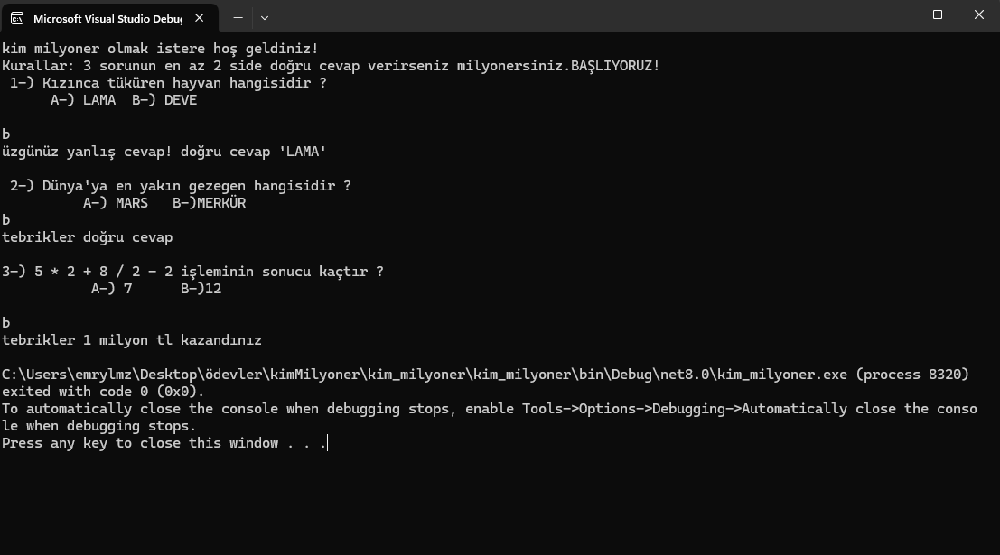

# KİM MİLYONER OLMAK İSTER - Konsol Uygulaması

Bu projede, klasik bilgi yarışması formatı olan **"Kim Milyoner Olmak İster"** temalı bir C# konsol uygulaması geliştirdim. Uygulamada kullanıcıya 3 adet çoktan seçmeli soru sorulmakta; en az 2 doğru cevaba ulaşan kullanıcı **1 milyon TL kazanmaktadır** (eğlencelik).

## 🛠 Kullanılan Yapılar

- `if-else` ve `else if` yapıları ile koullu akış sağlandı.
- Kullanıcıdan alınan girdilerde veri tipi dönüşümüne gerek duyulmadı; `string` türü yeterli oldu.
- Kullanıcının hem **cevap şıkkını (örneğin "A")** hem de **cevap metnini (örneğin "lama")** yazabilmesi için `||` (veya) mantıksal operatörü kullanıldı.
- Küçük/büyük harf duyarlılığını ortadan kaldırmak için `.ToLower().Trim()` ile girişler normalize edildi.

## ▶️ Nasıl Çalıştırılır?

1. Bu projeyi Visual Studio'da açın.
2. `Program.cs` dosyasını çalıştırın.
3. Konsol üzerinden gelen soruları cevaplayarak yarışmayı deneyimleyin.

## 💡 Notlar

- Proje tamamen öğrenim amaçlı geliştirilmiştir.
- Kod, temel C# bilgilerinin pratik edilmesi amacıyla yazılmıştır.
- Geliştirmeye ve sorulara yenilerini eklemeye açıktır.

## 📸 Ekran Görüntüsü

